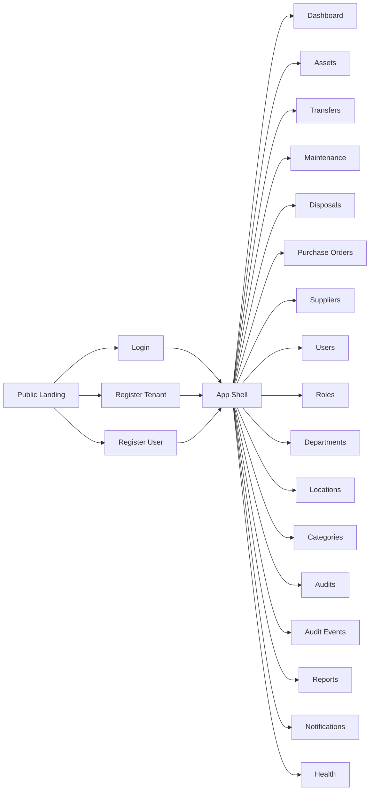

# Enterprise SaaS UI/UX Blueprint
## Asset Management System (Multi-Organisation)

This blueprint maps directly to supported backend behaviors:
- JWT + tenant scoping (`X-Organisation-Id`)
- CRUD + PATCH partial updates
- RBAC (`ROLE_ADMIN`, `ROLE_ORG_ADMIN`, `ROLE_USER`)
- Compliance and traceability (audit logs + API audit events)

---

## 1) UX Architecture Map

### 1.1 Global Information Architecture



### 1.2 Navigation Model
- **Primary nav (left sidebar):** Dashboard, Asset Lifecycle, Procurement, Access Control, Compliance, Platform.
- **Context sub-nav (top of module):** `List`, `Board/Timeline`, `Policies`, `History`, `Settings` depending on module.
- **Command bar (global):** quick-search across assets, users, suppliers, POs, transfer IDs, request IDs.
- **Tenant context rail:** pinned org badge (`X-Organisation-Id` active), no cross-org blend in one view.

### 1.3 Role-Based Visibility (UI Gating)

| Module | ROLE_ADMIN | ROLE_ORG_ADMIN | ROLE_USER |
|---|---|---|---|
| Dashboard | Full | Org-scoped | Read-only |
| Assets | Full CRUD/PATCH/assign | Full CRUD/PATCH/assign | Read-only |
| Transfers | Full workflow | Full workflow | Read-only |
| Purchase Orders | Full + approve/reject | Create/edit + approve if policy allows | Read-only |
| Users/Roles | Full | Org-scoped user mgmt | Read-only own profile |
| Compliance (Audits/Audit Events) | Full | Org-scoped | Read-only (if permitted) |
| Notifications | Full personal + org prefs | Full personal + org prefs | Personal only |

---

## 2) Enterprise Screen Inventory (High-Fidelity Spec)

## 2.1 Public Experience (Pre-Auth)
- **Landing page**
  - Hero: value prop, outcomes, trust signals.
  - Feature bands: lifecycle, compliance, procurement, analytics.
  - CTA cluster: `Login`, `Register Organisation`, `Join Existing Workspace`.
  - Comparison panel: manual process vs platform outcomes.

## 2.2 App Shell
- Left rail: grouped nav + role-aware visibility.
- Top bar: breadcrumbs, tenant badge, global search, notification bell, profile menu.
- Right context panel (optional): recent activity, pending tasks.

## 2.3 Dashboard
- KPI cards: assets total/in-use/maintenance, pending PO approvals, overdue maintenance, unresolved audit findings.
- Alerts block: expiring warranties, failed webhooks, rejected transfers.
- Quick actions: add asset, request transfer, create PO, schedule maintenance.
- “Pending approvals” queue card with direct actions.

## 2.4 Assets
- **List view**: dense table with column selector, saved filters, bulk actions.
- **Detail view**: profile + tabs (`Overview`, `Lifecycle`, `Maintenance`, `Transfer History`, `Audit Trail`).
- **Create/Edit forms**
  - Full edit mode (PUT-equivalent when required)
  - Partial edit mode (PATCH only changed fields)
- **Employee assignment drawer**
  - Assign: `POST /assets/{assetId}/assign-user/{userId}`
  - Unassign: `DELETE /assets/{assetId}/assign-user`

## 2.5 Transfers
- Kanban statuses: `REQUESTED`, `APPROVED`, `REJECTED`, `IN_TRANSIT`, `COMPLETED`, `CANCELLED`.
- Row actions: approve/reject/complete with inline confirmations.
- Timeline panel on detail page for approval chain.

## 2.6 Categories / Locations / Departments
- Hierarchical tree + table split pane.
- Inline child create under selected parent.
- PATCH micro-edit in side sheet for quick updates.

## 2.7 Users / Roles
- Users table: status pills, role, department, last activity.
- Role assignment flow uses dedicated endpoint (`/users/{id}/role`).
- Roles page: permission matrix + JSON inspector for backend parity.

## 2.8 Suppliers / Purchase Orders
- Supplier profile with linked POs and asset counts.
- PO lifecycle board + table hybrid.
- Approval actions (`approve` / `reject`) on row and detail header.
- Canonical enum labels only in create/edit (`SUBMITTED`, not `PENDING`).

## 2.9 Maintenance / Disposals / Audits
- Maintenance planner with due-date grouping and completion action.
- Disposal record with compliance artifacts section.
- AssetAudit records show immutable constraints (delete disabled or policy-limited).

## 2.10 Audit Events (New)
- Filter bar: actor, method, success, time range, requestId.
- Event list: method/path/status/success/timestamp.
- Detail panel: actorEmail, requestId, handler, query, response status, user agent, client IP.
- Incident mode: “show all failures in last 24h” preset.

## 2.11 Notifications
- Inbox list with filters + batch actions.
- Preferences panel: in-app/push/email categories, digest controls.
- Summary cards: unread/total/by type.

---

## 3) Component Library

## 3.1 Core Components
- `AppShell`, `SideNav`, `TopBar`, `TenantBadge`
- `DataGridPro` (sorting/filtering/column pinning/save view/bulk actions)
- `DetailDrawer`, `TimelinePanel`, `ActivityFeed`
- `FormScaffold`, `PatchFieldGroup`, `ConflictBanner`, `ForbiddenState`
- `StatusPill`, `ApprovalActionBar`, `EmptyState`, `ErrorPanel`
- `AuditEventCard`, `RequestTraceBadge`

## 3.2 States
- Loading: skeleton rows + preserved column layout.
- Empty: contextual CTA and quick-create path.
- Error: service unavailable and retry.
- Forbidden (403): explicit permission message + role hint.
- Conflict (409): inline conflict resolution CTA.
- Validation (400): field-level + summary at top.

---

## 4) Design Tokens

## 4.1 Color System
- `--color-bg`: `#0B1020`
- `--color-surface`: `#11182B`
- `--color-surface-muted`: `#161F36`
- `--color-border`: `#2A3553`
- `--color-text`: `#E6EBF5`
- `--color-text-muted`: `#A4B0CC`
- `--color-primary`: `#12B981`
- `--color-primary-strong`: `#0E9F6E`
- `--color-info`: `#3B82F6`
- `--color-warning`: `#F59E0B`
- `--color-danger`: `#EF4444`
- `--color-success`: `#22C55E`

## 4.2 Typography
- Headings: `Manrope` 600/700
- Body/UI: `IBM Plex Sans` 400/500
- Mono: `IBM Plex Mono`

## 4.3 Spacing / Radius / Elevation
- Spacing scale: 4, 8, 12, 16, 24, 32, 40, 56
- Radius: 8 (inputs), 12 (cards), 16 (panels)
- Shadow: low for cards, medium for drawers, high for modals

## 4.4 Interaction Tokens
- Focus ring: 2px `--color-info`, 2px offset.
- Hover surfaces: +4% luminance.
- Disabled opacity: 0.45 with no pointer events.

---

## 5) Interaction Specs (Critical Flows)

## 5.1 Create Asset + PATCH Update
1. Create form submits full payload to `POST /assets`.
2. Subsequent edits use patch mode: compute changed fields only.
3. Submit to `PATCH /assets/{id}`.
4. On `400 errors`: map server field errors inline.
5. On success: append activity item to timeline panel.

## 5.2 Assign / Unassign Asset Employee
1. Open assignment drawer from asset row/detail.
2. Assign call: `POST /assets/{assetId}/assign-user/{userId}` with empty body.
3. Unassign call: `DELETE /assets/{assetId}/assign-user`.
4. Update assigned badge immediately after response.

## 5.3 PO Draft Edit + Approval/Rejection
1. Draft edits via `PATCH /purchase-orders/{id}`.
2. Show lifecycle badge + action buttons only for permitted roles.
3. Approve/reject call to dedicated actions.
4. Status transitions reflected in activity timeline.

## 5.4 Maintenance Schedule to Complete
1. Create maintenance record.
2. Partial updates via PATCH (cost/status).
3. Complete via `/maintenance/{id}/complete` action.
4. Asset status sync shown in related asset timeline.

## 5.5 Disposal + Compliance
1. Record disposal with required approver linkage.
2. PATCH allowed for incremental updates (e.g., saleValue, reason).
3. Compliance section stores references and immutable timestamps.

## 5.6 Audit Event Investigation
1. Open Audit Events module with failure preset.
2. Filter: actorId/method/start/end/success.
3. Open event detail panel; inspect `requestId`, `handler`, `clientIp`, `userAgent`.
4. Link to impacted entity detail page where possible.

## 5.7 Role-Based Gating
- Hide restricted controls by role.
- If deep link hits forbidden action, return 403 state panel with explanation and fallback actions.

---

## 6) API-Aware UI Contracts

## 6.1 Tenant Context
- Always show active organisation badge.
- Lock context in session; changing org prompts full context refresh.
- All tenant-scoped actions surface current org in confirmation dialogs.

## 6.2 PATCH vs Full Edit
- **PATCH mode:** side-sheet quick edit with diff preview.
- **Full edit mode:** complete form (for create or full replace cases).
- PATCH payload builder: omit unchanged and empty values unless explicit clear is intended.

## 6.3 Status Code UX
- `400`: field errors + top summary.
- `403`: permission panel + “request access” guidance.
- `409`: conflict banner with “refresh latest data” and “compare changes”.

## 6.4 Enum Discipline
- Use canonical enums in selectors and badges.
- For PO status display, normalize legacy `PENDING` to `SUBMITTED` visually and in outbound payloads.

## 6.5 Compliance Constraints
- Display immutable badges on protected records (audit logs, compliance entries).
- Remove destructive actions when policy disallows.

---

## 7) Advanced Table UX Standard
- Saved views per module (personal + shared)
- Multi-sort, faceted filters, quick filter chips
- Column chooser + sticky key columns
- Bulk actions with safety confirmation
- Export current filtered result
- Keyboard shortcuts: `/` search, `g+d` dashboard, `g+a` assets

---

## 8) Accessibility & Trust
- WCAG AA contrast targets for all text/state combinations.
- Keyboard-first traversal for tables, menus, and modals.
- ARIA labels for icon-only buttons.
- Visible focus states on every interactive component.
- Time and status information never color-only; always include text label.

---

## 9) Frontend Handoff Notes

## 9.1 Suggested Naming Map
- `EntityListPage`, `EntityDetailPage`, `EntityPatchDrawer`
- `useTenantContext()`, `usePermissionGate()`, `usePatchPayload<T>()`
- `ApiErrorPanel`, `ConflictResolutionDialog`, `AuditTimeline`

## 9.2 PATCH Payload Utility
```ts
export const buildPatchPayload = <T extends Record<string, unknown>>(prev: T, next: T): Partial<T> => {
  const patch: Partial<T> = {};
  Object.keys(next).forEach((k) => {
    const key = k as keyof T;
    if (next[key] !== prev[key]) patch[key] = next[key];
  });
  return patch;
};
```

## 9.3 Form Modes
- `create`: full required validation.
- `edit-full`: full object validation.
- `patch-quick`: changed fields only.

## 9.4 Quality Gates
- Every module must define:
  - role-gated actions matrix
  - field-level 400 mapping
  - 403 and 409 UI states
  - loading/empty/error designs
  - table saved-view behavior

---

## 10) Rollout Plan
1. **Foundation:** tokens, shell, data-grid standard, role gate utilities.
2. **Operations:** Assets, POs, Transfers, Maintenance, Disposals.
3. **Governance:** Audits, Audit Events, Reports.
4. **Refinement:** Accessibility pass, keyboard shortcuts, telemetry.

